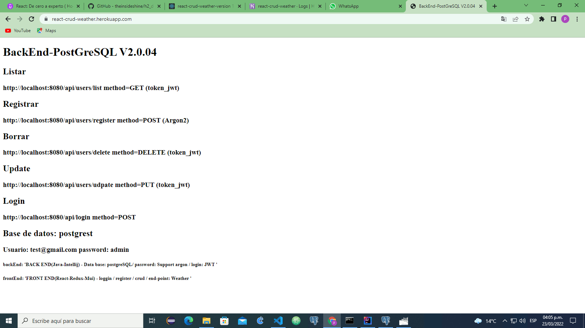

The intention of this project is to be able to test in a client the authentication with token-jwt and
a crud in a postgrest database with Argon2, in addition to having logging information by console

Initially it was developed with the h2 database, and then when uploaded to heroku it was migrated to postgreSql

rute list

Logger heroku

post man token

post man loggin

postgreSql dataBase

video de de Usos:
